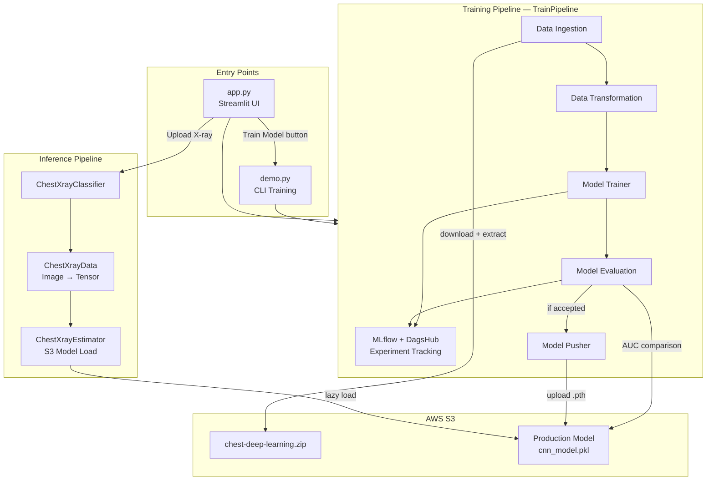
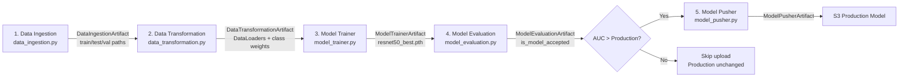
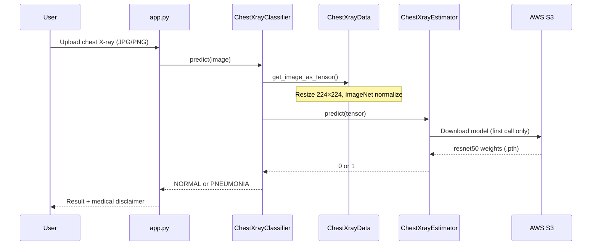
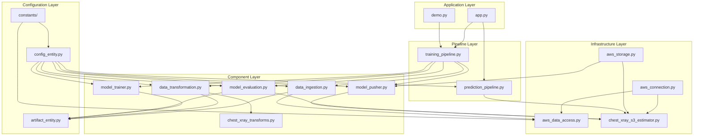

# Chest X-Ray Pneumonia Classifier — End-to-End MLOps Pipeline

> **Production-minded deep learning system** that ingests medical imaging data from AWS S3, trains a ResNet50 classifier with experiment tracking, promotes models only when they beat production, and serves predictions through a Streamlit web app.

**Author:** Shubham Mishra  
**Stack:** PyTorch · AWS S3 · MLflow · DagsHub · Streamlit  
**Domain:** Medical imaging · Binary classification (NORMAL vs PNEUMONIA)

---

## Why This Project Matters

Pneumonia remains a leading cause of death in children and the elderly worldwide. Chest X-rays are a primary diagnostic tool, but interpretation requires trained radiologists and is time-consuming at scale. This project demonstrates how to **take a real clinical imaging problem from raw data to a deployable, monitored ML system** — not just a Jupyter notebook with a `.pth` file.

What makes this more than a model demo:

| Capability | What it shows |
|---|---|
| **Modular pipeline architecture** | Each stage (ingest → transform → train → evaluate → push) is isolated, testable, and communicates via typed artifacts |
| **Cloud-native data & model registry** | Dataset and production model live in S3; training is reproducible from remote storage |
| **Model governance** | New models are promoted to production **only if ROC-AUC beats the current S3 model** |
| **Experiment tracking** | Every run logs hyperparameters, per-epoch metrics, confusion matrices, and model weights to MLflow via DagsHub |
| **Imbalance-aware training** | EDA-driven class weighting + weighted sampling for a ~2.89× NORMAL/PNEUMONIA skew |
| **Production UI** | Streamlit app for live inference + on-demand retraining from the sidebar |

---

## System Architecture

### High-Level Overview



### Training Pipeline — Stage by Stage



### Inference Flow



---

## File & Module Interconnections

Understanding how files connect is key to the design. The project follows a **component → artifact → pipeline** pattern inspired by production MLOps templates.

```
MLOPs-Project-02/
│
├── app.py                          ← Streamlit entry: prediction + retrain trigger
├── demo.py                         ← CLI entry: runs TrainPipeline only
│
├── config/
│   ├── model.yaml                  ← (placeholder) future hyperparam config
│   └── schema.yaml                 ← (placeholder) future data schema
│
├── src/
│   ├── constants/__init__.py       ← S3 bucket names, env var keys, artifact paths
│   │
│   ├── entity/
│   │   ├── config_entity.py        ← INPUT configs for each pipeline stage
│   │   ├── artifact_entity.py      ← OUTPUT dataclasses passed between stages
│   │   └── chest_xray_s3_estimator.py  ← PyTorch-specific S3 load/save/predict
│   │
│   ├── configuration/
│   │   └── aws_connection.py       ← Singleton boto3 S3 client (reads .env)
│   │
│   ├── data_access/
│   │   └── aws_data_access.py      ← Low-level S3 zip download + extraction
│   │
│   ├── cloud_storage/
│   │   └── aws_storage.py          ← Generic S3 helpers (upload, key check)
│   │
│   ├── components/                 ← One file = one pipeline stage
│   │   ├── data_ingestion.py       ← Uses aws_data_access → produces paths
│   │   ├── chest_xray_transforms.py← Augmentation definitions (EDA-driven)
│   │   ├── data_transformation.py  ← ImageFolder + WeightedRandomSampler
│   │   ├── model_trainer.py        ← ResNet50 fine-tuning loop
│   │   ├── model_evaluation.py     ← Test metrics + production comparison
│   │   └── model_pusher.py         ← Conditional S3 upload
│   │
│   ├── pipeline/
│   │   ├── training_pipeline.py    ← Orchestrator: wires all components + MLflow
│   │   └── prediction_pipeline.py  ← ChestXrayClassifier + ChestXrayData
│   │
│   ├── logger/__init__.py          ← Rotating file logs under logs/
│   └── exception/__init__.py       ← MyException with file/line context
│
└── experiments/                    ← EDA notebooks + plots that informed design
```

### Dependency Graph (Who Calls Whom)



---

## Model & ML Design Decisions

### Architecture
- **Backbone:** ResNet50 (ImageNet pretrained), fully frozen
- **Head:** `Linear(2048→256) → ReLU → Dropout(0.4) → Linear(256→2)`
- **Classes:** `NORMAL (0)` · `PNEUMONIA (1)`

### Training Strategy
| Setting | Value | Rationale |
|---|---|---|
| Optimizer | Adam (lr=1e-4) | Standard for fine-tuning pretrained heads |
| Loss | Weighted CrossEntropyLoss | Handles class imbalance |
| Sampler | WeightedRandomSampler | Balanced batches during training |
| Scheduler | ReduceLROnPlateau | Adapts LR when val loss plateaus |
| Early stopping | Patience = 3 | Prevents overfitting on val set |
| Epochs | 15 (max) | Configurable via `ModelTrainerConfig` |

### EDA-Informed Preprocessing
Notebooks in `experiments/` drove concrete engineering choices:
- **199 unique image sizes** → standardized resize to 224×224
- **~2.89× class imbalance** → weighted loss + weighted sampling
- **Medically realistic augmentations only** — horizontal flip, slight rotation, brightness jitter; no vertical flips or heavy distortions

### Model Promotion Policy
```
IF no model in S3          → accept new model (first deployment)
IF trained_AUC > prod_AUC  → push to S3, replace production
ELSE                       → reject, keep existing production model
```
Primary metric: **ROC-AUC** (threshold-independent, robust to class imbalance).

---

## Tech Stack

| Layer | Technology |
|---|---|
| Deep Learning | PyTorch, torchvision (ResNet50) |
| Cloud Storage | AWS S3, boto3 |
| Experiment Tracking | MLflow, DagsHub |
| Web UI | Streamlit |
| Metrics | scikit-learn (AUC, precision, recall, F1, confusion matrix) |
| Config & Env | python-dotenv, dataclasses |
| Logging | Python logging (file + console) |
| Packaging | setuptools (`pip install -e .`) |

---

## Quick Start

### 1. Clone & install

```bash
git clone https://github.com/smishra2004/MLOPs-Project-02.git
cd MLOPs-Project-02
python -m venv venv
source venv/bin/activate        # Windows: venv\Scripts\activate
pip install -r requirements.txt
pip install -e .
pip install scikit-learn Pillow  # used but not listed in requirements.txt
```

### 2. Configure environment

Create a `.env` file in the project root:

```env
AWS_ACCESS_KEY_ID=your_access_key
AWS_SECRET_ACCESS_KEY=your_secret_key
```

For MLflow/DagsHub tracking, authenticate with DagsHub CLI or set your token per [DagsHub docs](https://dagshub.com/docs/integration_guide/mlflow/).

### 3. Run inference (Streamlit)

```bash
streamlit run app.py
```

Upload a chest X-ray image. The app loads the production model from S3 and returns **NORMAL** or **PNEUMONIA**.

### 4. Run training pipeline

```bash
# CLI
python demo.py

# Or click "Train Model" in the Streamlit sidebar
```

Artifacts are written to `artifacts/` and `logs/`. Experiments appear on [DagsHub MLflow](https://dagshub.com/smishra2004/MLOPs-Project-02.mlflow).

---

## What Each Pipeline Stage Does

| Stage | File | Input | Output |
|---|---|---|---|
| **Data Ingestion** | `data_ingestion.py` | S3 zip key | Local `train/`, `test/`, `val/` directory paths |
| **Data Transformation** | `data_transformation.py` | Directory paths | PyTorch `DataLoader`s + class weight tensor |
| **Model Trainer** | `model_trainer.py` | DataLoaders | `resnet50_best.pth` + training history |
| **Model Evaluation** | `model_evaluation.py` | Saved model + test loader | Acceptance decision + MLflow metrics |
| **Model Pusher** | `model_pusher.py` | Accepted model path | Upload to S3 production key |
| **Prediction** | `prediction_pipeline.py` | PIL image | `"NORMAL"` or `"PNEUMONIA"` string |

Each stage receives a **config dataclass** (what it needs) and returns an **artifact dataclass** (what the next stage consumes). This makes the pipeline easy to extend — add a validation stage, swap the model, or plug in a new data source without rewriting the orchestrator.

---

## AWS S3 Layout

| Key | Purpose |
|---|---|
| `chest-deep-learning.zip` | Full dataset (train/test/val splits) |
| `cnn_model.pkl` | Production model weights (PyTorch `.pth` format) |

Bucket: `chest-x-ray-dataset-cnn` · Region: `us-east-1`

---

## Project Highlights for Reviewers

1. **Separation of concerns** — Training, evaluation, and inference are in distinct modules with single responsibilities (trainer never touches test set; evaluator never trains).

2. **Artifact-driven pipeline** — Typed dataclasses (`DataIngestionArtifact`, etc.) enforce clear contracts between stages, reducing coupling.

3. **PyTorch-aware S3 layer** — `ChestXrayEstimator` bypasses pickle-based loading and uses `torch.load()` for `.pth` checkpoints — a real integration detail that breaks naive sklearn-style model registries.

4. **Governed deployments** — Automatic AUC-based model promotion prevents silently shipping a worse model.

5. **Observable runs** — MLflow logs params, per-epoch metrics, test metrics, confusion matrix PNG, and model artifact in a single run.

6. **EDA → engineering loop** — Notebooks in `experiments/` directly informed augmentation choices and imbalance handling.

---

## Roadmap

- [ ] Containerize with Docker (`Dockerfile` scaffold exists)
- [ ] Add GitHub Actions CI/CD (lint, test, train-on-schedule)
- [ ] Implement data validation stage
- [ ] Populate `config/model.yaml` for externalized hyperparameters
- [ ] Add unit tests for components and integration tests for the pipeline
- [ ] Model confidence scores in the Streamlit UI
- [ ] Kubernetes deployment manifest

---

## Disclaimer

This tool is for **research and educational purposes**. AI-assisted predictions are not a substitute for professional medical diagnosis. Always consult a qualified healthcare provider.

---

## License

MIT License — see [LICENSE](LICENSE).

---

## Contact

**Shubham Mishra**  
📧 shubham.smishra2004@gmail.com  
🔗 [GitHub](https://github.com/smishra2004) · [DagsHub](https://dagshub.com/smishra2004/MLOPs-Project-02)
